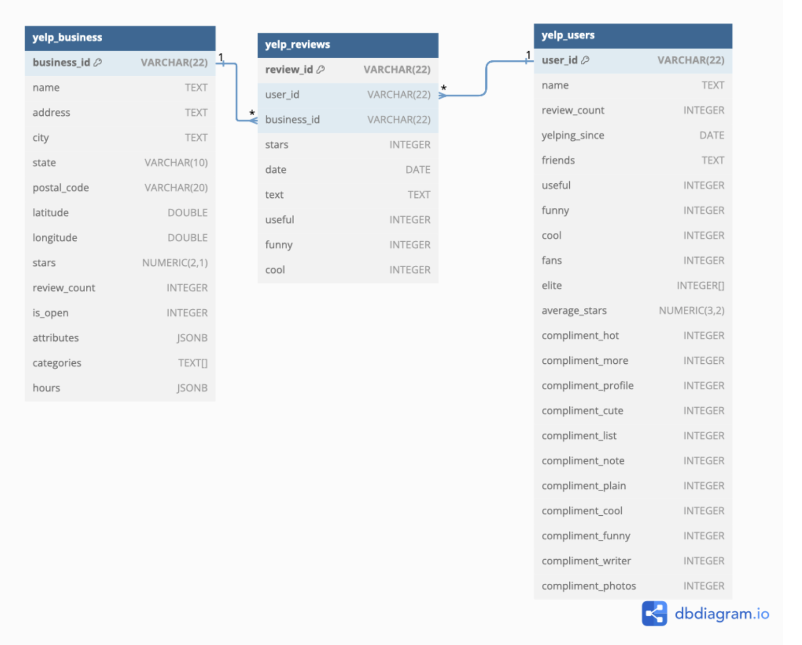
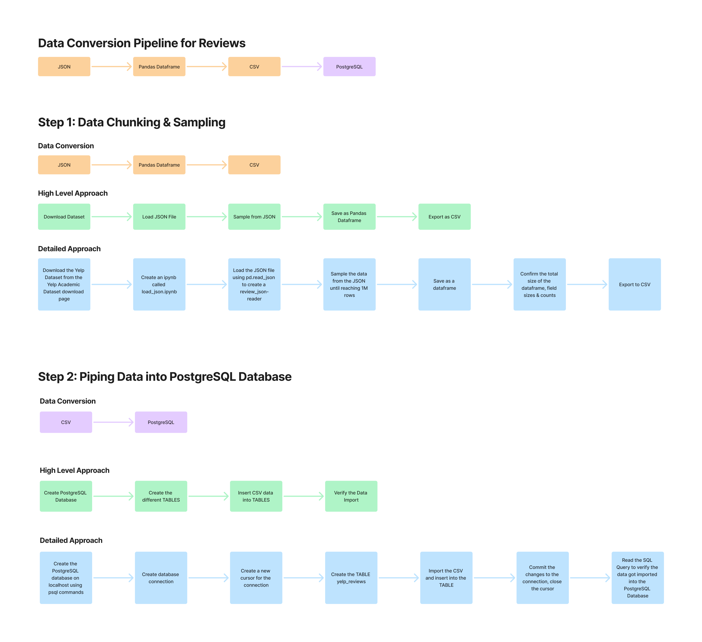
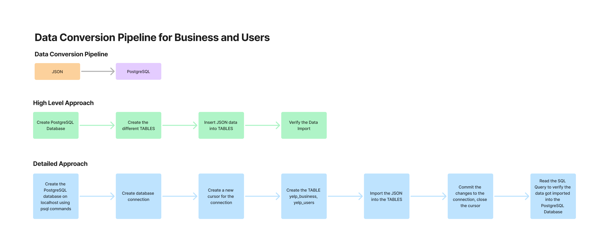

# Project Checkpoint

The Team:
| Name   | SID   | Email   |
|------------|------------|------------|
| Manan Bhargava | 3036535321 | manan.bhargava@berkeley.edu |
| Bianca Isabel Poblano | 3035917442 | bpoblano@berkeley.edu |
| Nawoda Wijesooriya | 3037027827 | nawodakw@berkeley.edu |

 

# Yelp Dataset Analysis

## Dataset Selection

For this project, we chose the Yelp Dataset from the Yelp Open Dataset, which includes various aspects of business reviews, check-ins, user data, and more. This dataset was selected because it provides a rich source of real-world data that can be analyzed for various purposes, such as business performance evaluation and user analysis. 

The data is freely available on Yelp’s official website (https://www.yelp.com/dataset). We downloaded the dataset in the form of JSON files. We focused primarily on the users.json, reviews.json and business.json files for this project, as these provided the most important information for our potential queries.

The business.json dataset contains **150,346 rows** and **14 columns**, has a file size of **118.9 MB**, and took **8.5s** to load. The exported business.csv file size is 99.1 MB, and took 5.2s to export from a pd dataframe to CSV format.
The users.json dataset contains **1,987,897 rows** and **22 columns**, has a file size of **3.36 GB**, and took **3 minutes and 21.0 seconds** to load. We cannot sample from the users dataset because of the foreign key constraint.
The reviews.json dataset contains **6,990,280 rows** and **9 columns**, has a file size of **5.34 GB**, and took **9 minutes and 52.2 seconds** to load the complete dataset. As a result of the substantial file size and load time, we decided to sample the dataset. 

We performed the sampling using the JSON reader object provided by pandas, which allowed us to read the dataset in chunks and sample the rows as we went through them. We specifically sampled 1M rows of reviews, which allowed us to create a representative sample while keeping the dataset size manageable. 

With sampling, the process took **1 minute and 42 seconds** to sample **1,000,000 rows** from the review table. These sampled datasets are a lot more manageable than using the entire dataset. 

The sampling process took some time, especially when dealing with the large sizes of the reviews and users datasets. We therefore stored the sampled data to a CSV file using review_df.to_csv('../data/review.csv', index=False) for ease of access in the future. 

**Database Structure**:
We used PostgreSQL to store and manage the sampled dataset. The database schema is relational, consisting of a table for reviews, business, and users. The tables are linked by foreign keys with reviews linking to business by a business_id column and reviews linking to users by the user_id column.

**ER Diagram**:

**Data Loading Process**:
1. Data Extraction: We started by downloading the Yelp dataset, which is available in JSON format.
2. Sampling and Truncation: We then used Python and pandas to sample and truncate the dataset. Specifically, we read the JSON files in chunks and randomly  sampled rows to reduce the size of the dataset, ensuring it was manageable for processing and analysis.
3. Data Loading into PostgreSQL: The sampled data was then loaded into the PostgreSQL database using SQL commands. For each table, we created a CREATE TABLE statement with appropriate columns and data types. The data was imported from CSV files generated from pandas into the database via the COPY command.

 

## System and Database Setup

The following is a comprehensive diagram of the different steps involved, with the data conversion pipeline, high level approach, and detailed approach. We described the detailed approach even more in detail down below.

The process of loading the data into PostgreSQL and setting up the database schema has been completed successfully, and a portion of the dataset is now available for querying.

Code Figure 1: Creating PostgreSQL Tables

Code Figure 2: Inserting business data into PostgreSQL table

Code Figure 3: Inserting user data into PostgreSQL table

Code Figure 4: Inserting user data into PostgreSQL table

Code Figure 5: Sampling the reviews table

Code Figure 6: Ensuring the random sample has an adequate and useful distribution

Code Figure 7: Initializing the Reviews Table

We are using our local computers for the compute resources, and are using the same setup to store the database.

## PostgreSQL Tasks and Queries

* Overview of the problem(s) you are trying to solve

### Task / Query 1

(For each query)

* Describe the problem
* Explain why this is a reasonable solution
* Evaluate it's performance
* Show the query
* Show the output

To demonstrate our progress, here is an example query that selects some data from the reviews table:
`SELECT *
FROM yelp_reviews
LIMIT 10;`

This query retrieves the first 10 rows from the reviews table, showcasing basic functionality and ensuring that the data is correctly loaded into the database. This simple query serves as a basic check on the integrity of the dataset and provides a snapshot of the review data. 

The screenshots for the queries are included below:

Task 1: Analyze the count of yelp_business
Problem: Need to determine the total number of rows in the yelp_business dataset.
Reasonable Solution: Simply uses the COUNT(*) function.
Performance, query, and output shown here:

Task 2: Analyze the count of reviews per user in the yelp_reviews dataset.
Problem: Need to determine the number of reviews per user.
Reasonable Solution: Uses the GROUP BY functionality.
Performance, query, and output shown here:

Task 3: Count of yelp_users
Problem: Need to determine the total number of users.
Reasonable Solution: Simply uses the COUNT(*) function.
Performance, query, and output shown here:

Therefore, we have seen that we successfully load and parse all three datasets, with a light level of cleaning and transformations applied to ensure that all of the data is well formed and correctly loaded in. We've also shown different queries which involve different types of scanning and joins.

## Future Plan (Checkpoint Only)

The next steps involve integrating non-relational parts of the dataset into the project using Apache Spark for processing and storing large-scale data. Apache Spark will be used to handle the unstructured portions of the Yelp dataset, such as review text and business categories. Spark's distributed processing capabilities will allow us to process large datasets efficiently, and its ability to work seamlessly with both structured (SQL-based) and unstructured data (using Spark SQL and DataFrames) makes it an ideal choice for handling complex queries and large-scale analytics.

We will compare the performance of PostgreSQL (a relational database) and Apache Spark (a distributed data processing system) by evaluating query response times, scalability, and flexibility in handling large-scale data. This comparison will help us determine the most effective system for different parts of our dataset and inform our decisions about future analysis.

By integrating both relational and distributed non-relational data processing systems, we aim to optimize our dataset storage, processing, and query execution, ensuring that the dataset is easy to access, scalable, and analyzable for future tasks.

